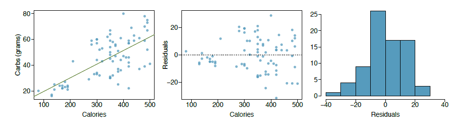
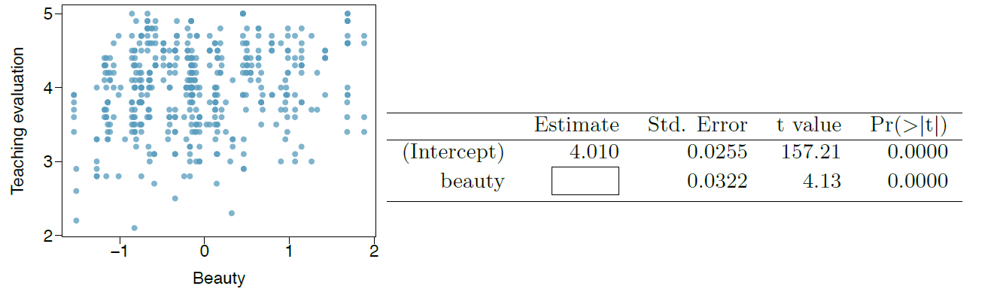
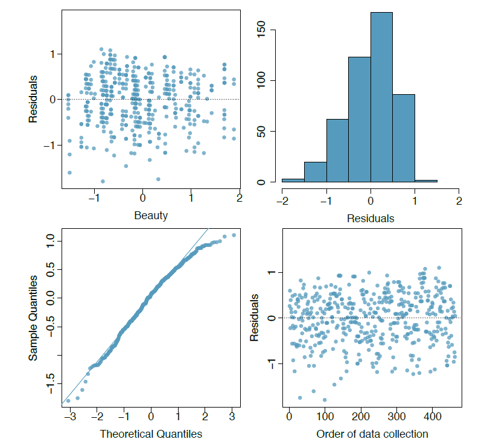

```{r setup, include=FALSE}
knitr::opts_chunk$set(echo = TRUE)
```

###7.24 

Nutrition at Starbucks, Part I. The scatterplot below shows the relationship between
the number of calories and amount of carbohydrates (in grams) Starbucks food menu items contain.
21 Since Starbucks only lists the number of calories on the display items, we are interested in
predicting the amount of carbs a menu item has based on its calorie content.



(a) Describe the relationship between number of calories and amount of carbohydrates (in grams)
that Starbucks food menu items contain.

####ANSWER

There appears to be a linear relationship between carbohydrates and calories.  As the number of calories increase so does the number of carbs. However, the relationship is not strong. 

(b) In this scenario, what are the explanatory and response variables?

####ANSWER

The explanatory variable is calories and the response variable is carbohydrates.

(c) Why might we want to fit a regression line to these data?

####ANSWER

We want to fit a regression line to make predictions about the number of carbs based on the number of calories. 

(d) Do these data meet the conditions required for fitting a least squares line?

####ANSWER

Conditions required for fitting a least squares line:
1. Linearity - Condition satisfied.  The scatter plot between the two variables show linearity.
2. Nearly normal residuals - Condition satisfied. The histogram shows a normal, unimodal, symmetrical distribution.
3. Constant variability - Condition IS NOT satisfied. The variability of the points is higher above the line.
4. Independent observations - Condition is met.  Assuming that calories and carbs are independent.

Summary, not all conditions are met.


###7.26

Body measurements, Part III. Exercise 7.15 introduces data on shoulder girth and
height of a group of individuals. The mean shoulder girth is 107.20 cm with a standard deviation
of 10.37 cm. The mean height is 171.14 cm with a standard deviation of 9.41 cm. The correlation
between height and shoulder girth is 0.67.

####ANSWER

(a) Write the equation of the regression line for predicting height.
```{r}

y= 171.14
std_y = 9.41
x = 107.20
std_x = 10.37
r = 0.67

slope = r*(std_y/std_x)
slope
bo = y - (slope*x)
bo
```

y = 105.9651 + 0.6079749x


(b) Interpret the slope and the intercept in this context.

####ANSWER

In this context, the slope represents the increase in height given an increase in shoulder girth.  Height increases 0.6079749 cm per shoulder girth.  The intercept represents when the x value is zero or no change in girth.

(c) Calculate R2 of the regression line for predicting height from shoulder girth, and interpret it
in the context of the application.

####ANSWER

The R2 of a linear model describes the amount of variation in the response that is
explained by the least squares line. In this context, the r2 is 0.4489

```{r}
r^2
```


(d) A randomly selected student from your class has a shoulder girth of 100 cm. Predict the height
of this student using the model.

####ANSWER

Given, the shoulder girth of 100 cm.  The student's height is 166.76 cm

```{r}
height = 105.9651 + (0.6079749*100)
height
```


(e) The student from part (d) is 160 cm tall. Calculate the residual, and explain what this residual
means.

####ANSWER

The residual is -6.76259 which means that the regression line overestimated the height by -6.76259

```{r}
Residual = 160 - height
Residual
```

(f) A one year old has a shoulder girth of 56 cm. Would it be appropriate to use this linear model
to predict the height of this child?

No. A one year old in the sample which consisted of 507 physically active individuals which we can assume to be adults. 

###7.30

Cats, Part I. The following regression output is for predicting the heart weight (in g) of cats
from their body weight (in kg). The coefficients are estimated using a dataset of 144 domestic cats.

(a) Write out the linear model.

####ANSWER

heart_weight = -0.357 + 4.034x

(b) Interpret the intercept.

####ANSWER

The intercept is when the cat's body weight is zero which is counter-intuitive since a cat's weight can never be zero.

(c) Interpret the slope.

####ANSWER

The slope measures the increase in heart_weight given an increase in body weight of the cat.  In this case, the heart weight increases 4.034 kilograms per body weight of a cat.

(d) Interpret R2.

####ANSWER

The coefficient of determination, R2, which is .6466 describes the proportion of the variation explained by the least squares regression line. 64.66% of the variation is explained by this linear relationship.

(e) Calculate the correlation coefficient.

####ANSWER

The r is  0.8041144

```{r}
r = sqrt(.6466)
r
```

###7.40

Rate my professor. Many college courses conclude by giving students the opportunity to evaluate the course and the instructor anonymously. However, the use of these student evaluations as an indicator of course quality and teaching e?ectiveness is often criticized because these measures may reflect the influence of non-teaching related characteristics, such as the physical appearance of the instructor. Researchers at University of Texas, Austin collected data on teaching evaluation score (higher score means better) and standardized beauty score (a score of 0 means average, negative score means below average, and a positive score means above average) for a sample of 463 professors.24 The scatterplot below shows the relationship between these variables, and also provided is a regression output for predicting teaching evaluation score from beauty score.




(a) Given that the average standardized beauty score is -0.0883 and average teaching evaluation
score is 3.9983, calculate the slope. Alternatively, the slope may be computed using just the
information provided in the model summary table.

####ANSWER

The slope is 0.1325028
```{r}
x1 = -0.0883
y1 = 3.9983
intercept = 4.010
slope = (y1-intercept) / x1
slope
```

(b) Do these data provide convincing evidence that the slope of the relationship between teaching
evaluation and beauty is positive? Explain your reasoning.

####ANSWER

The P value is < .05 which means that we can reject the null hypothesis.There is a relationship between teaching evaluation and beauty.


(c) List the conditions required for linear regression and check if each one is satisfied for this model
based on the following diagnostic plots.

####ANSWER



Conditions required for fitting a least squares line:

1. Linearity - Condition satisfied.  The scatter plot between the two variables show linearity.

2. Nearly normal residuals - Condition satisfied. The histogram shows a normal, unimodal, symmetrical distribution.

3. Constant variability - Condition satisfied. Spread around the residual line shows constant variability. 

4. Independent observations - Condition is met.  Professors were chosen randomly.

Summary, not all conditions are met.
